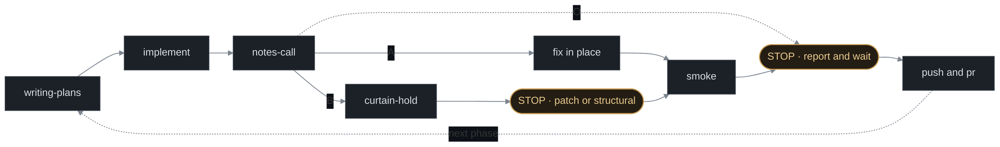

<p align="center">
  
</p>

<h1 align="center">prompt-corner</h1>

<p align="center">
  <em>The corner in the wings where the stage manager stands with the book and calls the show.</em>
</p>

<p align="center">
  
  
  
</p>

---

A feature that takes more than one session does not fail on the code. It fails on the things
nobody wrote down: the assumption phase 1 made about someone else's API, the contract phase 2
owed phase 3, the repo that merged while its counterpart PR sat open, the review that ticked
twelve files it never opened.

prompt-corner is seven skills that hold those seams. They drive a feature from design to the last
merged PR — and stop for you at every gate, every time, including when you tell them not to.

## Before / after

**Without.** Phase 3 discovers the partner API sends `merchantId`, not `merchant_id`. Phase 1
assumed otherwise, and built a mapper on it. Nobody wrote the assumption down, so nothing caught
it — two phases get re-scoped, in the session that can least afford it.

**With.** That assumption was a row in the map before phase 1 started:

| id | premise | type | status | evidence | who can confirm |
|---|---|---|---|---|---|
| P4 | LM sends `merchant_id` (snake) in the order webhook | external-api | ❓ | `partners/lineman/gotchas.md:88` | LM team |

`❓` means blocked, and blocked means phase 1 does not build on it. The verify script prints
`ASK P4` at the top of every session until a human settles it.

## The cast

| Skill | Calls the... | Job |
|---|---|---|
| **`stage-manager`** | cues | Drives a multi-phase feature end to end. Sequences the others, stops at every gate, never writes code itself. |
| **`prompt-book`** | book | Before phase 1: locks the rules, the contracts each phase owes the next, and every premise, each with a `file:line` and a status marker. |
| **`notes-call`** | notes | After a chunk: a coverage ledger where every changed hunk gets a row, then fix-it-here or escalate. |
| **`call-board`** | board | Where every feature stands across every repo — with the half-merge warning that a PR list alone can't give you. |
| **`curtain-hold`** | hold | A premise turned out false. Map the blast radius by grep, classify patch vs structural, stop for the human. |
| **`dress-run`** | dress rehearsal | Craft review of a diff: smell, over-engineering, comment noise, branch shape, cost, blast radius. |
| **`interval-call`** | interval | Before a compact: writes where the feature stands — step, open decisions, next action — so the next context resumes from a file, not a summary. |

## How it works

**Before phase 1** — the map is written once, and it stops twice:

```mermaid
%%{init: {"themeVariables": {"edgeLabelBackground": "#0d1117"}, "flowchart": {"nodeSpacing": 30, "rankSpacing": 38, "useMaxWidth": false, "curve": "basis"}}}%%
flowchart LR
    SM["stage-manager"] --> BS["brainstorming"] --> PB["prompt-book"]
    PB --> S1(["STOP · open premises"]) --> S2(["STOP · confirm the map"]) --> P1(["phase 1 →"])

    classDef default fill:#1c2128,stroke:#3d444d,stroke-width:1px,color:#d7dde5
    classDef stop fill:#241d14,stroke:#c99a4e,stroke-width:1.5px,color:#e8c98c
    class S1,S2 stop
    linkStyle default stroke:#7d8590,stroke-width:1.2px
```



**Then, per phase, in order** — and the loop only closes when a person says so:



| step | what it is bound by |
|---|---|
| `brainstorming` | skipped entirely when the design is already settled |
| `prompt-book` | rules, contracts and premises — written once, before phase 1 |
| `writing-plans` | this phase only, never the whole feature |
| `notes-call` | a script-built ledger; **A** it repairs itself, max 3 rounds; **O** waits for the owner at the STOP; **B** it escalates |
| `curtain-hold` | maps the blast radius, classifies, and never fixes anything |
| `smoke` | you drive what you can; the rest is a blocking checklist for a person |
| `push and pr` | one PR per repo, never a merge |

`dress-run` is the craft checklist the one reviewer per chunk walks inside `notes-call`;
`call-board` answers "where is everything" from outside the flow, at any point, and runs the
project's runtime checks before smoke. `interval-call` is invoked by hand before `/compact`: it
flushes what the chat still owes to disk and writes a handoff file whose `step` line `call-board`
reads back after the compact. For the compact nobody saw coming, the plugin ships two hooks: a
`PreCompact` hook writes the mechanical position (`branch@sha`, `git status`, `git log`, the
map and plan paths) to `<program>.handoff.auto.md`, and a `SessionStart` hook lists every
handoff file into the fresh context. A script can record where you were; only a person or the
skill can record what was undecided.

**Every `STOP` waits for a person.** There is no flag, mode, or phrasing that walks through one —
including a stop that arrives when the work is nearly done, which is the most expensive one to skip.

### What the ledger is for

`notes-call` does not write its ledger; a script does. `ledger.sh` measures the working tree
against the merge-base — committed, staged, unstaged and untracked in one range — picks every
symbol the hunks declare or re-declare, and greps the whole repo for each, callers **outside the
diff** first:

```
LEDGER  base origin/develop@c52ab2c · 5 files · 412 lines (+380/-32) · 1 untracked · 9 symbols
MODE    inline · floor 150 · fan-out 800

internal/service/order.go   +42/-8   hunks 214-224 300-310
  ApplyDiscount                6 hits · 4 outside diff (2 in excluded paths)
    report/daily.go:88:	total := svc.ApplyDiscount(o, nil)
  ErrMemberLocked              1 hits · 0 outside diff
```

It guarantees **completeness**, not depth: every changed file has a block and nothing in it is
the writer's word — doubt it, rerun it. Depth is the reviewer's job: open every outside-diff hit
and decide whether that caller is still right. The thresholds on the `MODE` line come from
`house.md`, so a project's review budget is a setting, not an argument with the skill.

### Three bins, not two

Every finding lands in one of three places. **A**: the plan says X, the code does not, the fix
stays inside the plan's files — fix it, up to three rounds, one commit per round. **O**: the code
and the plan disagree and the honest fix may be the plan's sentence — a bulk write through the
existing hook instead of the endpoint the plan named. One drift-log line, one bullet at the
STOP, the owner decides. **B**: one of seven structural criteria applies — a contract, a cross-repo
consumer, a second source of truth. Only B goes to `curtain-hold`.

### What a stop looks like

`curtain-hold` never fixes anything. It returns exactly this and waits:

```
ข้อเท็จจริง : voucher_id is nullable online — entity/order.go:88
ขัดกับ      : §3 contract "phase 2 always supplies voucher_id"
กระทบ       : receipt print (receipt.go:214) · KDS (summary.go:66)
จำแนก       : structural — เข้าเกณฑ์ข้อ C2
A (patch)      : null-guard at the mapper · 20 min · 2 readers left unguarded
B (structural) : fix §3, re-scope phase 3 · half a day
แนะนำ       : B — A leaves the same bug in two untracked places
```

## Install

### Claude Code — as a plugin (recommended)

A plugin namespaces every skill, so they read as `prompt-corner:stage-manager` in the skill list
and are easy to find next to your other sets:

```bash
claude plugin marketplace add Hin-Nattapat/prompt-corner
claude plugin install prompt-corner@prompt-corner
```

Or from inside a session, as two separate prompts:

```
/plugin marketplace add Hin-Nattapat/prompt-corner
```
```
/plugin install prompt-corner@prompt-corner
```

Skills load on the next session. `claude plugin details prompt-corner` shows the inventory and its
token cost (~1.2k always-on for all seven).

### Claude Code — as plain skills

Same skills, no namespace — they appear under their bare names. Use this if you'd rather not add a
marketplace:

```bash
# every project
npx skills add Hin-Nattapat/prompt-corner -g -a claude-code --skill '*' -y

# this project only
npx skills add Hin-Nattapat/prompt-corner -a claude-code --skill '*' -y
```

Pick one or the other. Installing both leaves two copies of every skill in the list.

### Other agents

The skills are plain [Agent Skills](https://agentskills.io) — swap `-a claude-code` for `-a codex`,
`-a cursor`, `-a opencode`, or any other host the [`skills`](https://github.com/vercel-labs/skills)
CLI supports. The workflow assumes a git repo and, for `call-board`, the `gh` CLI.

### Update

```bash
claude plugin update prompt-corner    # plugin install (restart to apply)
npx skills update -g                  # plain-skill install
```

### Uninstall

```bash
claude plugin uninstall prompt-corner@prompt-corner
claude plugin marketplace remove prompt-corner
# or, for a plain-skill install:
npx skills remove stage-manager prompt-book notes-call \
                  call-board curtain-hold dress-run interval-call
```

## Per-project settings — `.claude/house.md`

Every skill reads this file if it exists and falls back to a default if it doesn't. Nothing breaks
in a project that has never seen it. **Never edit a skill to hold something project-specific — that
is what this file is for.** Copy [`house.example.md`](house.example.md) to get started.

```yaml
---
repos: [service-a, service-b, ../other-workspace/web]
base-branch: develop
programs-dir: docs/programs
---
```

| Key / section | Read by | Default when absent |
|---|---|---|
| `repos:` | `call-board` | every git repo at the root and one level down |
| `base-branch:` | `notes-call`, `dress-run` | `origin/HEAD`, else `main` |
| `programs-dir:` | `prompt-book`, `call-board` | `.claude/programs/` |
| `review-floor-lines:` | `notes-call` | 150 — at or under, the review collapses |
| `review-fanout-lines:` | `notes-call` | 800 — above, the review fans out |
| `review-chunk-lines:` | `notes-call` | 600 per chunk |
| `review-max-chunks:` | `notes-call` | unlimited — set it and an over-budget fan-out stops to ask |
| `## Default flow` | `stage-manager`, `curtain-hold` | the sequence above |
| `## Git tail` | `stage-manager` | branch → group → rebase → push → PR, never merge |
| `## Smoke` | `stage-manager` | drive what you can, hand the rest over as a blocking checklist |
| `## Runtime` | `call-board`, `stage-manager` | not checked, and the report says so |
| `## Mutation` | `notes-call` chunk reviewers | hand mutation, capped at 20 mutants |
| `<programs-dir>/*.handoff.md`, `.claude/handoff.md` | written by `interval-call`, read by `call-board` | no handoff, nothing to resume from |
| `*.handoff.auto.md` | written by the `PreCompact` hook, read by `call-board` | the compact happened without the plugin |
| `.claude/review/` | chunk brief, round briefs and per-chunk ledger files written by `notes-call`; never committed | reviewers read the corpus, fix agents get no allowlist |
| `<programs-dir>/<program>.questions.md` | written by `prompt-book`, answered by a person | every 🔒/❓ stays open |
| `## Reference locations` | `prompt-book` | nothing to sweep |
| `## Known consumers` | `curtain-hold`, `dress-run` | grep only |
| `## Shared modules` | `dress-run` | callers are in-repo only |
| `## Hot paths` | `dress-run` | per-request paths, polls and webhooks |
| `## Extra warnings` | `call-board` | the three built-in warnings only |
| `## Review additions` | `dress-run` | the packs alone |

## Language packs

`dress-run` picks packs by the file extensions in the diff, on top of its universal groups
(comment noise, branch shape, over-engineering, dirty code with Fowler's shape smells, edge cases,
blast radius, cost):

| Extension | Pack |
|---|---|
| `*.go` | [`packs/go.md`](skills/dress-run/packs/go.md) |
| `*.ts *.tsx *.js *.jsx` | [`packs/react.md`](skills/dress-run/packs/react.md) |
| `*.py` | [`packs/python.md`](skills/dress-run/packs/python.md) |

A language with no pack still gets every universal group — the review says so in its opening line.
**Adding a language is one file**, no change to the skill.

## The program map

`prompt-book` writes one file per multi-session feature, in `programs-dir`, with six fixed
headings and a frontmatter block. [`reference/map-format.md`](skills/prompt-book/reference/map-format.md)
is the authority; the short version:

```yaml
---
program: <slug>
status: active|done|parked
phases: [...]
repos: [...]
last-touched: YYYY-MM-DD
---
## §0 reference locations   ## §1 rules + a metric that can fail
## §2 phase map             ## §3 contracts between phases
## §4 premises              ## §5 verify
```

§2 may end with `### ยังไม่ชัด` — work that is in scope but cannot yet be stated as a phase. It
stays out of `phases:` until the phase before it lands and sharpens it; fog is not pre-sliced.

Every §4 premise carries a status marker, and they are not decoration:

| | Meaning |
|---|---|
| ✅ | confirmed, with a `file:line` |
| ❓ | unverified — **do not plan past it** |
| 🔒 | only a human can settle it — **do not design over it** |
| 🔓 | waived on a date, with the assumption it rests on written down |
| ❌ | turned out false |

Every 🔒 and ❓ question is written to `<program>.questions.md` once, before phase 1, with the
evidence, the options and a blank `answer:` line — answered in the file or in the chat, it lands
back in the §4 row and the block is deleted. Asking in the chat alone is what a compact erases.

§5 points at a `verify-<program>.sh` built on the shipped
[`chk.sh`](skills/prompt-book/assets/chk.sh) — one `chk` line per premise a grep can settle, one
`ask` line per premise only a person can. `prompt-book` will not call it done until it has watched
the script actually print `FAIL` with an anchor deliberately broken. A script that has never failed
proves nothing.

## Design rules

- **A claim without a `file:line` gets cut, not softened.** A comment in the code is the previous
  author's belief, not evidence. The shape of our own code proves what we read, never what the
  other side sends.
- **Stops are not advisory.** Every gate ends by waiting for a human. "Auto mode" is not an
  exception, and neither is a stop that arrives when the work is nearly done — that is the most
  expensive moment to skip one, not the cheapest.
- **Reviews find edge cases; more assertions do not.** These skills weight reading and grepping
  over test volume on purpose.
- **A rule with no way to fail is not a rule.** Map rules carry the command that would go red.

## Development

Both install shapes copy the files rather than symlinking them, so an edit needs a refresh:

```bash
git clone https://github.com/Hin-Nattapat/prompt-corner && cd prompt-corner
$EDITOR skills/dress-run/packs/go.md
git push

# plugin install — then restart the session
claude plugin update prompt-corner

# plain-skill install — straight from the working copy, no push needed
npx skills add . -g -a claude-code --skill '*' -y
```

The second form takes a local path, so it picks up an edit without a push — handy while iterating.

**`claude plugin update` compares the `version` in `.claude-plugin/plugin.json`, not the commit.**
A push without a version bump reports "already at the latest version" and installs nothing. Bump the
version in the same commit as the change, every time.

Layout:

```
skills/<name>/SKILL.md          the skill; its description is what makes it fire
skills/prompt-book/assets/      chk.sh, seeded into a project's programs dir
skills/notes-call/assets/       ledger.sh, the script that builds the coverage ledger
skills/notes-call/reference/    ledger-design.md and measured.md — the reasoning and the numbers behind the rules; read when changing one
skills/interval-call/assets/    the two hook scripts: handoff-auto.sh (PreCompact), handoff-list.sh (SessionStart compact)
hooks/hooks.json                registers those two hooks when the plugin is enabled
skills/prompt-book/reference/   the program-map format authority
skills/dress-run/packs/         one file per language
house.example.md                the per-project settings template
```

## FAQ

**Do I have to use all seven?** No. `dress-run`, `call-board` and `interval-call` stand alone. `stage-manager` is the
one that assumes the others.

**Does it work in a repo with no program map?** Yes — that is the lean path, and it is where most
work stays. `notes-call` collapses to a few lines under its floor (150 lines and 5 files by default,
`review-floor-lines` in `house.md`), and `prompt-book` refuses to write a map for single-phase work.

**Will it commit or push for me?** Only one kind of commit: `notes-call` commits each fix round
as `fix: review round <n>` so nothing sits uncommitted, and the git tail squashes those. Pushing,
merging and running a project-wide formatter are refused at every diff size.

**Why is some of it in Thai?** The report formats are fixed strings the author reads at a glance.
They are transcribed verbatim, not translated, so they stay diffable.

## License

MIT
